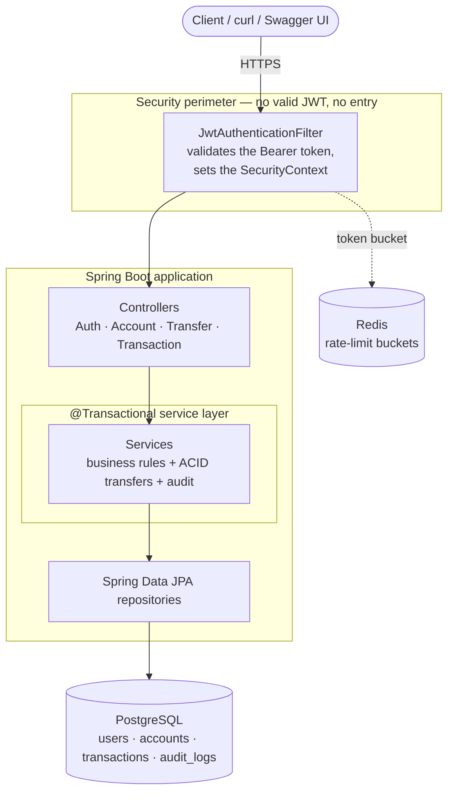

# SecureBank API

[](https://github.com/mohamedali55/SecureBank-API/actions/workflows/ci.yml)

A small but production-minded REST API for a fictional bank, written in **Java 17 / Spring Boot 3**. You can register, log in, open accounts, move money between them, and read your transaction history — all behind JWT auth, all written to an audit trail, and with transfers that are genuinely atomic: money is never created, lost, or left stranded halfway, even if the process dies mid-transfer.

I built this as a portfolio piece to show how I'd structure a real money-moving service — not just CRUD, but the parts that actually matter: correct concurrency, database migrations, rate limiting, sensible timeouts, a proper test suite, and a one-command local setup.

> Built with Java 17 · Spring Boot 3.3 · Spring Security · PostgreSQL 16 · Redis 7 · Flyway · JWT (JJWT) · springdoc/OpenAPI · JUnit 5 · Testcontainers · Docker.

---

## What's in the box

- **JWT authentication** — stateless; register/login hand back a signed token and a single `OncePerRequestFilter` guards every account endpoint.
- **Atomic transfers** — debit, credit, ledger entry and audit row all commit together or not at all, using row locks taken in a fixed order so concurrent transfers can't deadlock. (More on this below — it's the interesting part.)
- **Rate limiting** — a per-IP token bucket on the auth endpoints. In-memory by default, or Redis-backed (via an atomic Lua script) when you run more than one instance. Returns `429` + `Retry-After`, and fails open if Redis is down so a cache blip can't lock everyone out.
- **Audit log** — every register / login / account-open / transfer is recorded with who did it, what they did, and from which IP.
- **Flyway migrations** — the schema lives in versioned SQL and Hibernate runs in `validate` mode, so it never silently rewrites your tables.
- **Swagger UI** — generated from the code, with an Authorize button wired up for the bearer token.
- **Timeouts & graceful shutdown** — connection, query, transaction, HTTP and Redis timeouts, plus graceful shutdown so in-flight requests finish during a deploy.
- **Actually tested** — unit tests, an end-to-end HTTP test, a crash-mid-transfer rollback test, and a stress test that fires 1,000 concurrent transfers and checks the books still balance. CI runs all of it — against real Postgres and Redis — on every push.

---

## Architecture



It's a deliberately boring, one-directional layered design. A request comes in over HTTP, hits the JWT filter (no valid token, no entry), reaches a thin controller, drops into the `@Transactional` service layer where the business rules and ACID transfers live, and only ever touches Postgres through Spring Data JPA. Redis sits off to the side holding the rate-limit buckets — the request path doesn't depend on it being up.

---

## How transfers stay atomic

This is the part a banking interviewer actually asks about, so it got the most care. The whole of `TransferService#transfer` runs as a single database transaction:

1. **Cheap guards first** — no transferring to yourself, no zero or negative amounts.
2. **Lock both accounts** with `SELECT ... FOR UPDATE`, always locking the lower account id first. A fixed lock order means two opposite transfers (A→B and B→A) can never sit waiting on each other — no deadlocks.
3. **Authorize** — the caller has to actually own the source account.
4. **Check the rules** — both accounts active, same currency, enough money.
5. **Move it** — debit the source, credit the destination, write the ledger row, write the audit row.

All of those writes share one transaction at `READ_COMMITTED`. If anything throws — a bug, a constraint violation, or a literal crash — the whole thing rolls back and the database never sees a half-finished transfer. Money is stored as `BigDecimal` mapped to `NUMERIC(19,4)`, so there's no floating-point rounding anywhere near a balance.

I chose pessimistic locking + `READ_COMMITTED` over `SERIALIZABLE` on purpose: the row locks already serialize just the two accounts involved, so unrelated transfers aren't blocked and there's no serialization-failure retry loop to babysit. There's also a `@Version` column on `Account` as a second line of defense against lost updates.

And it isn't just a claim:

- [`TransferAtomicityIntegrationTest`](src/test/java/com/securebank/service/TransferAtomicityIntegrationTest.java) debits the source, forces a failure *before* the credit commits, and asserts both balances are untouched and no ledger row exists.
- [`ConcurrentTransferStressTest`](src/test/java/com/securebank/concurrency/ConcurrentTransferStressTest.java) throws 1,000 concurrent randomized transfers at a pool of accounts and checks the grand total never changes — then hammers a single account with twice as many withdrawals as it can afford and confirms exactly the affordable number succeed (no double-spend, no negative balance).

---

## Running it

### With Docker (nothing else required)

```bash
docker compose up --build
```

This builds the app inside a Maven container (so you don't need Maven installed), starts Postgres and Redis, waits for both to be healthy, runs the Flyway migrations, and serves the API with Redis-backed rate limiting turned on.

- API: http://localhost:8080
- Swagger UI: http://localhost:8080/swagger-ui.html
- Health: http://localhost:8080/actuator/health

Tear it down and wipe the data with `docker compose down -v`.

### Running the tests (just a JDK)

There's a Maven wrapper committed, so you don't need Maven installed:

```bash
./mvnw test        # macOS / Linux
.\mvnw.cmd test    # Windows
```

Most tests run on in-memory H2 and work anywhere. Two of them use Testcontainers to run against a real Postgres and a real Redis — those need a reachable Docker daemon and skip themselves cleanly when there isn't one. CI always has Docker, so they run there on every push.

To run the app against your own Postgres instead:

```bash
./mvnw spring-boot:run   # expects Postgres on localhost:5432 (db/user/pass = securebank), override via the env vars below
```

---

## API

Everything except `/api/auth/**` requires an `Authorization: Bearer <token>` header.

| Method | Path                      | Auth | What it does                                   |
|--------|---------------------------|:----:|------------------------------------------------|
| POST   | `/api/auth/register`      |  —   | Create a user, returns a JWT                    |
| POST   | `/api/auth/login`         |  —   | Authenticate, returns a JWT                     |
| POST   | `/api/accounts`           |  ✓   | Open an account (optional opening deposit)      |
| GET    | `/api/accounts`           |  ✓   | List your accounts                              |
| GET    | `/api/accounts/{id}`      |  ✓   | Get one of your accounts                        |
| POST   | `/api/transfers`          |  ✓   | Atomic transfer between accounts                |
| GET    | `/api/transactions`       |  ✓   | Your transaction history (paged, newest first)  |
| GET    | `/api/transactions/{id}`  |  ✓   | A single transaction you're party to            |

### A quick run-through

```bash
# 1. Register (returns a JWT)
TOKEN=$(curl -s -X POST http://localhost:8080/api/auth/register \
  -H 'Content-Type: application/json' \
  -d '{"username":"alice","email":"alice@example.com","password":"password123"}' \
  | sed -E 's/.*"token":"([^"]+)".*/\1/')

# 2. Open two accounts
A=$(curl -s -X POST http://localhost:8080/api/accounts \
  -H "Authorization: Bearer $TOKEN" -H 'Content-Type: application/json' \
  -d '{"currency":"USD","initialDeposit":100.00}' | sed -E 's/.*"id":([0-9]+).*/\1/')

B=$(curl -s -X POST http://localhost:8080/api/accounts \
  -H "Authorization: Bearer $TOKEN" -H 'Content-Type: application/json' \
  -d '{"currency":"USD"}' | sed -E 's/.*"id":([0-9]+).*/\1/')

# 3. Transfer $30 from A to B (atomic)
curl -s -X POST http://localhost:8080/api/transfers \
  -H "Authorization: Bearer $TOKEN" -H 'Content-Type: application/json' \
  -d "{\"fromAccountId\":$A,\"toAccountId\":$B,\"amount\":30.00,\"description\":\"rent\"}"

# 4. Read the history
curl -s http://localhost:8080/api/transactions -H "Authorization: Bearer $TOKEN"
```

Honestly the nicest way to poke at it is Swagger UI — register, click **Authorize**, paste the token, and every endpoint is right there.

---

## Tests

```bash
./mvnw test
```

| Test | What it proves |
|------|----------------|
| `TransferServiceUnitTest` | Business rules — insufficient funds, self-transfer, ownership (plain Mockito) |
| `TransferAtomicityIntegrationTest` | A crash mid-transfer rolls back; money is conserved and no ledger row leaks (H2, runs everywhere) |
| `TransferPostgresAtomicityTest` | The same proof against real Postgres + Flyway (Testcontainers) |
| `ConcurrentTransferStressTest` | 1,000 concurrent randomized transfers keep the books balanced; a contended account can't be over-drawn |
| `AuthAndTransferE2ETest` | `401` without a token, then the full register → transfer → history flow over real HTTP (MockMvc) |
| `RateLimiterFilterTest` | Auth endpoints return `429` past the bucket capacity; per-IP buckets stay independent |
| `RedisRateLimiterIntegrationTest` | The Redis-backed limiter throttles via the atomic Lua bucket (Testcontainers) |

The two Testcontainers tests (`TransferPostgresAtomicityTest`, `RedisRateLimiterIntegrationTest`) need Docker; they skip if no daemon is reachable and always run in CI.

---

## Configuration

Everything has a sensible local default and can be overridden by environment variable:

| Variable | Default | Purpose |
|----------|---------|---------|
| `SPRING_DATASOURCE_URL` | `jdbc:postgresql://localhost:5432/securebank` | Database URL |
| `SPRING_DATASOURCE_USERNAME` / `_PASSWORD` | `securebank` | Database credentials |
| `SECURITY_JWT_SECRET` | dev-only key (≥256 bits) | HMAC signing key — **override in production** |
| `SECURITY_JWT_EXPIRATION_MS` | `3600000` | Token lifetime (1 hour) |
| `SECURITY_RATE_LIMIT_ENABLED` | `true` | Toggle auth rate limiting |
| `SECURITY_RATE_LIMIT_BACKEND` | `memory` | `memory` or `redis` |
| `SECURITY_RATE_LIMIT_CAPACITY` | `10` | Burst size per IP on `/api/auth/**` |
| `SECURITY_RATE_LIMIT_REFILL_TOKENS` / `_REFILL_PERIOD_SECONDS` | `10` / `60` | Refill rate |
| `SPRING_DATA_REDIS_HOST` / `_PORT` | `localhost` / `6379` | Redis (used when backend is `redis`) |
| `MANAGEMENT_HEALTH_REDIS_ENABLED` | `false` | Include Redis in the health check |
| `DB_POOL_MAX_SIZE` | `10` | Hikari max pool size |
| `SERVER_TOMCAT_MAX_THREADS` | `200` | Tomcat worker threads |
| `SERVER_PORT` | `8080` | HTTP port |

### Timeouts & shutdown

Nothing is allowed to hang, and deploys are clean:

| Layer | Setting |
|-------|---------|
| Connection pool | Hikari `connection-timeout=10s`, `max-lifetime=30m`, keepalive `5m`, leak detection `30s` |
| Every JPA query | `jakarta.persistence.query.timeout=15s` backstop |
| Money transfer | `@Transactional(timeout=10s)` — bounds lock waits and statement time, then rolls back |
| HTTP / Tomcat | `connection-timeout=5s`, `keep-alive-timeout=15s`, bounded threads + accept queue |
| Async MVC | `request-timeout=20s` |
| Redis | 2s connect + command timeout; limiter fails open on errors |
| Shutdown | `server.shutdown=graceful`, 30s drain window; container `stop_grace_period=30s` |
| Container | non-root user, `HEALTHCHECK`, container-aware heap (`MaxRAMPercentage=75`) |

---

## Database

The schema is versioned by Flyway in [`src/main/resources/db/migration`](src/main/resources/db/migration). `V1__init_schema.sql` creates:

- **users** — BCrypt password hash, role, unique username/email.
- **accounts** — `account_number`, owner FK, `NUMERIC(19,4)` balance with a `CHECK (balance >= 0)`, currency, status, and an optimistic-lock `version`.
- **transactions** — an immutable ledger: reference, from/to account FKs, amount with `CHECK (amount > 0)`, type, status.
- **audit_logs** — append-only trail: username, action, detail, IP, timestamp.

---

## Project layout

```
src/main/java/com/securebank/
├── config/        SecurityConfig, OpenApiConfig, JWT + rate-limit properties, rate-limiter wiring
├── controller/    Auth · Account · Transfer · Transaction REST controllers
├── domain/        JPA entities + enums (User, Account, Transaction, AuditLog)
├── dto/           Request/response records + ApiError
├── exception/     Custom exceptions + GlobalExceptionHandler
├── repository/    Spring Data JPA repositories (incl. findByIdForUpdate row lock)
├── security/      JWT provider/filter, UserPrincipal, rate-limit filter
│   └── ratelimit/ RateLimiter interface + in-memory and Redis implementations
└── service/       Auth · Account · Transfer · Transaction · Audit
```

---

## What I'd do before calling it production

The big three — rate limiting, timeouts, and CI against real infrastructure — are already done. Beyond that:

- Pull `SECURITY_JWT_SECRET` from a real secret store instead of an env default.
- Put TLS in front of it and only trust `X-Forwarded-For` from a known proxy.
- Add refresh tokens and a revocation / deny-list.
- Tune the connection pool and add read replicas if traffic ever needs it.

It's a fictional bank and a portfolio project, not something I'd put real money through — but the bones are the ones I'd use for the real thing.
