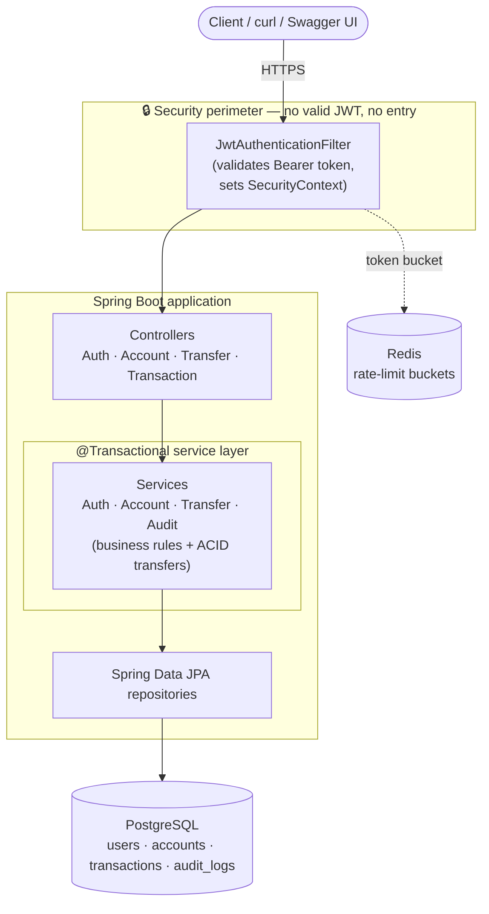

# SecureBank API

[](https://github.com/mohamedali55/SecureBank-API/actions/workflows/ci.yml)

A production-style REST banking API built with **Java 17 · Spring Boot 3 · Spring Security · PostgreSQL · JWT · Flyway · Docker**.

Users register, log in, open accounts, transfer money, and read their transaction history. Every endpoint sits behind a JWT filter, every action is written to an audit trail, and **every money transfer is atomic** — money is never created, destroyed, or stranded between accounts, even if the application crashes mid-transfer.

---

## Highlights

- 🔐 **Stateless JWT auth** — register/login issue signed tokens; all account endpoints are protected by a `OncePerRequestFilter`.
- 🚦 **Rate limiting** — per-client-IP token bucket on `/api/auth/**` (in-memory or **Redis-backed** via an atomic Lua script for multi-instance deployments); returns `429` + `Retry-After`, fails open if Redis is down.
- ⏱️ **Timeouts everywhere** — connection, statement/query, transaction, lock, HTTP, and async timeouts so nothing hangs; **graceful shutdown** drains in-flight requests on SIGTERM.
- 🔁 **CI** — GitHub Actions runs the full suite (incl. Postgres + Redis Testcontainers) on every push.
- 💸 **ACID transfers** — debit + credit + ledger entry + audit row all commit or all roll back, with `SELECT ... FOR UPDATE` row locks acquired in deadlock-free order.
- 🧾 **Audit logging** — every register/login/account/transfer action is recorded with actor, action, detail, and IP.
- 🗄️ **Flyway migrations** — schema is versioned in SQL; Hibernate only *validates* it (`ddl-auto=validate`).
- 📖 **OpenAPI/Swagger UI** — auto-generated, with an "Authorize" button wired to the JWT bearer scheme.
- 🐳 **One-command run** — `docker compose up --build` starts Postgres + the API.
- ✅ **Proven, not claimed** — a test forces a crash mid-transfer and asserts no money is lost (against both H2 and, when Docker is present, real Postgres).

---

## Architecture

A classic layered Spring Boot architecture. A request flows in one direction through four layers; nothing past the security perimeter is reachable without a valid JWT, and every database write happens inside a `@Transactional` boundary.



```
            ┌─────────────────────────────────────────────────────────┐
 Client ──► │  🔒 JwtAuthenticationFilter   (rejected if no valid JWT) │   ← security perimeter
            └──────────────────────────────┬──────────────────────────┘
                                           ▼
                         ┌──────────────────────────────────┐
                         │  Controllers (REST, validation)   │
                         └──────────────────┬───────────────┘
                                           ▼
                ╔══════════════════════════════════════════════════╗
                ║  @Transactional Service layer                    ║  ← ACID boundary
                ║  business rules • atomic transfers • audit       ║
                ╚══════════════════════════┬═══════════════════════╝
                                           ▼
                         ┌──────────────────────────────────┐
                         │  Spring Data JPA repositories     │
                         └──────────────────┬───────────────┘
                                           ▼
                              ┌─────────────────────────┐
                              │       PostgreSQL         │
                              └─────────────────────────┘
```

---

## The detail that matters: atomic transfers

The whole transfer runs inside a single database transaction (`TransferService#transfer`):

1. **Pre-lock guards** — reject self-transfer and non-positive amounts.
2. **Lock both accounts** with a pessimistic `SELECT ... FOR UPDATE`, always in **ascending id order** so two opposing transfers can never deadlock.
3. **Authorize** — the caller must own the source account.
4. **Business rules** — both accounts active, same currency, sufficient funds.
5. **Move the money** — debit source, credit destination, write the ledger `Transaction`, write the audit row.

All five writes share one transaction at `READ_COMMITTED` isolation. Combined with the row locks, that prevents lost updates without the retry storms a full `SERIALIZABLE` isolation would cause. If *anything* throws — including a process crash simulated in the test — the transaction rolls back and **the database never sees a partial transfer**.

> Why pessimistic locking + `READ_COMMITTED` rather than `SERIALIZABLE`?
> Row locks serialize access to exactly the two accounts involved, so concurrent transfers on *other* accounts aren't blocked, and we avoid the serialization-failure-and-retry loop that `SERIALIZABLE` requires under contention. The `@Version` column on `Account` is a second line of defense against lost updates.

This is verified by [`TransferAtomicityIntegrationTest`](src/test/java/com/securebank/service/TransferAtomicityIntegrationTest.java): it debits the source, forces a crash *before* the credit commits, then asserts both balances are unchanged, the total is conserved, and no ledger row exists.

---

## Tech stack

| Concern         | Choice                                              |
|-----------------|-----------------------------------------------------|
| Language        | Java 17 (builds & runs on 17–24+)                   |
| Framework       | Spring Boot 3.3 (Web, Data JPA, Security, Validation, Actuator) |
| Auth            | JWT (JJWT 0.12), BCrypt password hashing            |
| Database        | PostgreSQL 16, Flyway migrations                    |
| Cache / limiter | Redis 7 (Lettuce) — distributed rate-limit buckets  |
| Money           | `BigDecimal` / `NUMERIC(19,4)` — never floats       |
| Docs            | springdoc-openapi (Swagger UI)                      |
| Tests           | JUnit 5, Mockito, Spring Test/MockMvc, Testcontainers, H2 |
| CI              | GitHub Actions (`.github/workflows/ci.yml`)         |
| Packaging       | Multi-stage Docker build, Docker Compose            |

---

## Quick start

### Option A — Docker (only Docker required)

```bash
docker compose up --build
```

This builds the app inside a Maven container (no local Maven needed), starts PostgreSQL **and Redis**, waits for both to be healthy, runs Flyway migrations, and serves the API (with Redis-backed rate limiting enabled).

- API base:      http://localhost:8080
- Swagger UI:    http://localhost:8080/swagger-ui.html
- Health:        http://localhost:8080/actuator/health

Stop and wipe data with `docker compose down -v`.

### Option B — Run tests locally (only a JDK required)

A Maven Wrapper is included, so you don't need Maven installed:

```bash
# Windows
.\mvnw.cmd test

# macOS / Linux
./mvnw test
```

The atomicity proof and the full HTTP/JWT flow run against in-memory H2 — no Docker needed. If a Docker daemon **is** available, the additional `TransferPostgresAtomicityTest` also runs the same proof against real PostgreSQL; otherwise it skips itself cleanly.

To run the app locally against your own Postgres:

```bash
./mvnw spring-boot:run
# expects postgres at localhost:5432, db/user/pass = securebank (override via env vars below)
```

---

## API reference

All `/api/accounts`, `/api/transfers`, and `/api/transactions` endpoints require an `Authorization: Bearer <token>` header.

| Method | Path                      | Auth | Description                                  |
|--------|---------------------------|------|----------------------------------------------|
| POST   | `/api/auth/register`      | —    | Create a user, returns a JWT                  |
| POST   | `/api/auth/login`         | —    | Authenticate, returns a JWT                   |
| POST   | `/api/accounts`           | ✅   | Open an account (optional opening deposit)    |
| GET    | `/api/accounts`           | ✅   | List your accounts                            |
| GET    | `/api/accounts/{id}`      | ✅   | Get one of your accounts                      |
| POST   | `/api/transfers`          | ✅   | Atomic transfer between accounts              |
| GET    | `/api/transactions`       | ✅   | Your transaction history (paged, newest first)|
| GET    | `/api/transactions/{id}`  | ✅   | One transaction you're party to               |

### Example flow

```bash
# 1. Register (returns a JWT)
TOKEN=$(curl -s -X POST http://localhost:8080/api/auth/register \
  -H 'Content-Type: application/json' \
  -d '{"username":"alice","email":"alice@example.com","password":"password123"}' \
  | sed -E 's/.*"token":"([^"]+)".*/\1/')

# 2. Open two accounts
A=$(curl -s -X POST http://localhost:8080/api/accounts \
  -H "Authorization: Bearer $TOKEN" -H 'Content-Type: application/json' \
  -d '{"currency":"USD","initialDeposit":100.00}' | sed -E 's/.*"id":([0-9]+).*/\1/')

B=$(curl -s -X POST http://localhost:8080/api/accounts \
  -H "Authorization: Bearer $TOKEN" -H 'Content-Type: application/json' \
  -d '{"currency":"USD"}' | sed -E 's/.*"id":([0-9]+).*/\1/')

# 3. Transfer $30 from A to B (atomic)
curl -s -X POST http://localhost:8080/api/transfers \
  -H "Authorization: Bearer $TOKEN" -H 'Content-Type: application/json' \
  -d "{\"fromAccountId\":$A,\"toAccountId\":$B,\"amount\":30.00,\"description\":\"rent\"}"

# 4. Read history
curl -s http://localhost:8080/api/transactions -H "Authorization: Bearer $TOKEN"
```

The easiest way to explore is **Swagger UI**: register/login, click **Authorize**, paste the token, and try every endpoint.

---

## Testing

```bash
./mvnw test
```

| Test                                | Proves                                                                 |
|-------------------------------------|-----------------------------------------------------------------------|
| `TransferServiceUnitTest`           | Business rules: insufficient funds, same-account, ownership (Mockito) |
| `TransferAtomicityIntegrationTest`  | **Crash mid-transfer rolls back; money conserved** (H2, always runs)  |
| `TransferPostgresAtomicityTest`     | Same proof against real Postgres + Flyway (Testcontainers; skips without Docker) |
| `AuthAndTransferE2ETest`            | 401 without a token; full register→transfer→history flow via MockMvc  |
| `ConcurrentTransferStressTest`      | **1000 concurrent randomized transfers** conserve money + corrupt nothing; concurrent over-draw never double-spends |
| `RateLimiterFilterTest`             | Auth endpoints return `429` past capacity; per-IP buckets are independent |
| `RedisRateLimiterIntegrationTest`   | Redis-backed limiter throttles via the atomic Lua bucket (Testcontainers; skips without Docker) |

> **Note on `TransferPostgresAtomicityTest`:** it self-skips when Docker isn't reachable by the
> Java client. Some very recent Docker Desktop builds expose an API that the bundled
> `docker-java` transport can't negotiate over the Windows named pipe (the Docker CLI and
> `docker compose` are unaffected). If it skips on your machine, the H2
> `TransferAtomicityIntegrationTest` already proves the identical atomicity guarantee, and the
> same flow is verified live against real Postgres via `docker compose up` (see below).

---

## Database schema

Versioned by Flyway in [`src/main/resources/db/migration`](src/main/resources/db/migration). `V1__init_schema.sql` creates:

- **users** — credentials (BCrypt hash), role, unique username/email.
- **accounts** — `account_number`, owner FK, `NUMERIC(19,4)` balance with a `CHECK (balance >= 0)`, currency, status, optimistic-lock `version`.
- **transactions** — immutable ledger: reference, from/to account FKs, amount with `CHECK (amount > 0)`, type, status.
- **audit_logs** — append-only trail: username, action, detail, ip, timestamp.

---

## Project structure

```
src/main/java/com/securebank/
├── config/        SecurityConfig, OpenApiConfig, JwtProperties
├── controller/    Auth / Account / Transfer / Transaction REST controllers
├── domain/        JPA entities + enums (User, Account, Transaction, AuditLog)
├── dto/           Request/response records + ApiError
├── exception/     Custom exceptions + GlobalExceptionHandler
├── repository/    Spring Data JPA repositories (incl. findByIdForUpdate lock)
├── security/      JwtTokenProvider, JwtAuthenticationFilter, UserPrincipal, ...
└── service/       AuthService, AccountService, TransferService, TransactionService, AuditService
```

---

## Configuration

All settings have sensible local defaults and can be overridden by environment variables:

| Variable                      | Default                                            | Purpose                          |
|-------------------------------|----------------------------------------------------|----------------------------------|
| `SPRING_DATASOURCE_URL`       | `jdbc:postgresql://localhost:5432/securebank`      | Database URL                     |
| `SPRING_DATASOURCE_USERNAME`  | `securebank`                                        | Database user                    |
| `SPRING_DATASOURCE_PASSWORD`  | `securebank`                                        | Database password                |
| `SECURITY_JWT_SECRET`         | dev-only secret (≥256 bits)                        | HMAC signing key — **override in prod** |
| `SECURITY_JWT_EXPIRATION_MS`  | `3600000` (1 hour)                                  | Token lifetime                   |
| `SECURITY_RATE_LIMIT_ENABLED` | `true`                                              | Toggle auth rate limiting        |
| `SECURITY_RATE_LIMIT_BACKEND` | `memory`                                            | `memory` or `redis`              |
| `SECURITY_RATE_LIMIT_CAPACITY`| `10`                                                | Burst size per IP on `/api/auth/**` |
| `SECURITY_RATE_LIMIT_REFILL_TOKENS` | `10`                                          | Tokens restored per period       |
| `SECURITY_RATE_LIMIT_REFILL_PERIOD_SECONDS` | `60`                                  | Refill period (seconds)          |
| `SPRING_DATA_REDIS_HOST`      | `localhost`                                         | Redis host (used when backend=redis) |
| `SPRING_DATA_REDIS_PORT`      | `6379`                                              | Redis port                       |
| `MANAGEMENT_HEALTH_REDIS_ENABLED` | `false`                                         | Include Redis in the health check |
| `DB_POOL_MAX_SIZE`            | `10`                                                | Hikari max pool size             |
| `SERVER_TOMCAT_MAX_THREADS`   | `200`                                               | Tomcat worker threads            |
| `SERVER_PORT`                 | `8080`                                              | HTTP port                        |

### Resilience & timeouts

Nothing is allowed to hang, and shutdowns are clean:

| Layer | Setting |
|-------|---------|
| Connection pool | Hikari `connection-timeout=10s`, `max-lifetime=30m`, `keepalive=5m`, leak detection 30s |
| Per query | `jakarta.persistence.query.timeout=15s` (backstop for every JPA query) |
| Money transfer | `@Transactional(timeout=10s)` — bounds lock waits and statement time, then rolls back |
| HTTP / Tomcat | `connection-timeout=5s`, `keep-alive-timeout=15s`, bounded threads + accept queue |
| Async MVC | `spring.mvc.async.request-timeout=20s` |
| Redis | command + connect timeout `2s`; limiter **fails open** on Redis errors |
| Shutdown | `server.shutdown=graceful` + `timeout-per-shutdown-phase=30s`; container `stop_grace_period=30s` |
| Container | non-root user, `HEALTHCHECK`, container-aware heap (`MaxRAMPercentage=75`) |

### Production checklist

- ✅ Rate limiting on `/api/auth/**` (per-IP token bucket; Redis backend for multi-instance limits).
- ✅ Timeouts on DB, queries, transactions, HTTP, and Redis; graceful shutdown.
- ✅ CI runs the full test suite (including real Postgres + Redis) on every push.
- ⬜ Replace `SECURITY_JWT_SECRET` with a strong secret from a vault.
- ⬜ Terminate TLS in front of the app (the diagram assumes HTTPS) and set `X-Forwarded-For` from a *trusted* proxy only.
- ⬜ Consider refresh tokens and token revocation (deny-list).
- Tune the Hikari pool and add DB read replicas as needed.
